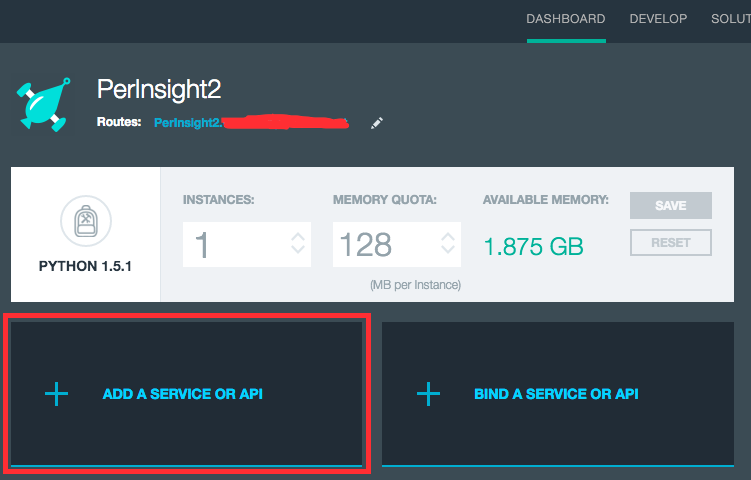
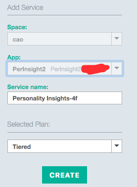

# Personality Insight App Overview

The Personality Insight app demonstrates a simple, reusable Python web application that uses Watson **Personality Insights** and **Insights for Twitter** service in Bluemix. If you follow the steps carefully, you'll learn the followings:

* How to use Bluemix and cloud foundry (cf) comman line interfaces (cli)?
* How to create application and services via cf cli?
* How to bind a service to an application?
* How to remove application and services via cf cli?
* How to run the Python code locally?
* How to retrieve tweets from *Insights for Twitter Service*?
* How to retrieve insights from *Watson Personality Insights* service?


You can find the application in [Bluemix](http://perinsight.w3ibm.mybluemix.net/).

## Prerequisites

1. Install [cloud foundry command line interface] (https://github.com/cloudfoundry/cli/releases)
2. Make sure that you have Python version >= 3.5.


## Run the app in Bluemix

1. Download the code to your computer: `git clone git@github.com:bulutmf/PerInsight.git`.
2. cd into the app directory: `cd PerInsight`
3. Open the `manifest.yml` file and edit `name` and `host` fields to something else. Don't use the **PerInsight** as it is already taken. Your host name should be unique in Bluemix, i.e. not taken by someone else. Take a note of the **[APP_NAME]**.
4. Set the api end point to dedicated bluemix: `cf api https://api.w3ibm.bluemix.net`
5. Login: `cf login`.
6. Push the application code to Bluemix: `cf push`
7. Create a **Insights for Twitter** service. You can do this in two different ways: command line or Web UI.
  * **Web UI**:
    * Find your application in Bluemix dashboard and click on it.   
    
    * Click on *ADD A SERVICE OR API* button.   
    
    * Find *Insights for Twitter* service in *Data and Analytics* group and click on it.  
    
    * Click on *Create* button to create your Twitter service. You can change the *service name* to your choice. Make sure that you choose the *Free Plan*. If it's asked, *Restage* your application.  
    
    * Click on *Overview* on the left side to see the services that are binded to your application.  
    
    * You can find the credentials of your service if you click on *Show Credentials* button.  
    
  * **Command line**:
    * Create the service: `cf create-service twitterinsights Free twitter-insights-service`. We named the service *twitter-insights-service*, you can name it whatever you want, however we use the same name to bind the service to the application in next step.
    * Bind *twitter-insights-service* to your application *[APP_NAME]*: `cf bind-service [APP_NAME] twitter-insights-service`.
    * Restage your application so that env variables can be accessed from the application: `cf restage [APP_NAME]`.
8. Create a **Personality Insights** service. You can do this again in two different ways: command line or Web UI. Choose the one you like.
  * **Web UI**:
    * Find your application in Bluemix dashboard and click on it.  
    
    * Click on *ADD A SERVICE OR API* button.  
    
    * Find *Personality Insights* service in *Watson* group and click on the service.  
    
    * Click on *Create* button to create your Personality Insights service. You can change the *service name* to your choice. If it's asked, *Restage* your application.  
    
    * Click on *Overview* on the left side to see the services that are binded to your application.  
    
    * You can find the credentials of your service if you click on *Show Credentials* button.  
    
  * **Command line**:
    * Create the service: `cf create-service personality_insights tiered personality-insights-service`. We named the service *personality-insights-service*, you can name it whatever you want, however we use the same name to bind the service to the application in next step.
    * Bind *personality-insights-service* to your application *[APP_NAME]*: `cf bind-service [APP_NAME] personality-insights-service`.
    * Restage your application so that env variables can be accessed from the application: `cf restage [APP_NAME]`.
9. Once you completed step 8, you should be able to see your services binded to your application in the *Overview* page. Click on the url of your application to visit the website.  


## Run the app locally

You can run the Python app locally. If you use Anaconda to manage your Python packages follow the steps for Anaconda, otherwise you can follow the steps without Anaconda.

**Note1**: You should first follow the above steps and run the app in Bluemix so that you created the services.  
**Note2**: Steps explained below are tested in Mac. Commands should be similar for Windows environment.

#### With Anaconda

1. Install [Anaconda](https://www.continuum.io/downloads) (if you haven't done so)
2. Download the code to your computer: `git clone git@github.com:bulutmf/PerInsight.git`.
3. cd into the app directory: `cd PerInsight`
4. Create an environment: `conda create --name venv python=3.5`
5. Activate the environment: `source activate venv`
6. Install the packages: `conda install --file requirements.txt`
8. Open the `server.py` file and set the values for `TWITTER_API_USERNAME`, `TWITTER_API_PASSWORD`, `PERSONALITY_INSIGHT_API_USERNAME` and `PERSONALITY_INSIGHT_API_PASSWORD`. You can find these values from Bluemix: Dashboard => Click on the app => Look for `Show Credentials` link on each of the service tiles.  

9. Run `python server.py`
10. Access the running app in a browser at: [http://localhost:3000] (http://localhost:3000)

#### Without Anaconda

1. [Install Python][] (if you haven't installed it yet). Note that the app uses Python version 3.5. You can check if python is install via: `python --version`
2. Download the code to your computer: `git clone git@github.com:bulutmf/PerInsight.git`.
3. cd into the app directory: `cd PerInsight`
4. Install **virtualenv** package: `pip3.5 install virtualenv`
5. Create a virtual env: `virtualenv -p python3.5 venv`
6. Activate the new virtual environment: `source venv/bin/activate`
7. Install the required Python packages: `pip install -r requirements.txt`
8. Open the `server.py` file and set the values for `TWITTER_API_USERNAME`, `TWITTER_API_PASSWORD`, `PERSONALITY_INSIGHT_API_USERNAME` and `PERSONALITY_INSIGHT_API_PASSWORD`. You can find these values from Bluemix: Dashboard => Click on the app => Look for `Show Credentials` link on each of the service tiles.  

9. Run `python server.py`
10. Access the running app in a browser at: [http://localhost:3000] (http://localhost:3000)

[Install Python]: https://www.python.org/downloads/


## Use iPython Notebook to try out the services

**jupyter** folder includes the iPython notebooks for both retrieving the tweets from Insights for Twitter service and getting insights from Watson Personality Insights service. Follow below steps to run it locally.

1. Start jupyter notebook web server: `jupyter notebook`.
2. Visit `http://localhost:8888/tree` on your web browser.
3. Click *upload* and select iPython file (*tweets.ipynb*) to upload.  

4. Change the credentials. You can find the credentials from Bluemix.   

5. Run it.


## Clean up

You can clean up the resources you created in two ways.

1. **Web UI**:
  * Go to the Bluemix dashboard and click on the settings button on the top right of your application tile and select *Delete App*  
  
2. **Command Line**
  * Run this command to get [APP_NAME]: `cf apps`
  * Delete: `cf delete [APP_NAME]` (replace [APP_NAME] with your application name).
  * Run this command to get service names for both Insights for Twitter service (*[SERVICE_1]*) and Watson Personality Insights service (*[SERVICE_2]*): `cf services`
* Delete Insights for Twitter Service: `cf delete-service [SERVICE_1]`
* Delete Personality Insight Service: `cf delete-service [SERVICE_2]`


## How the app works?

The app provides a REST API end point `analyze?twitterHandle=fatih_bulut` which accepts `GET` requests with user's twitter handle as a parameter. Once the twitter handle is retrieved the app will function in three steps: *Retrieving tweets from Twitter*, *Retrieving insights from Watson service* and finally *Presenting insights to end user*. Backend code is in `server.py` file whereas the front end code is in `static/index.html` file. Below shows the `analze` implementation.

```Python
def analyze(self, twitterHandle):
      tweets = self.getTweets(twitterHandle)
      jsonContentItems = self.tweetsToContentItem(tweets)
      insights = self.getInsights(jsonContentItems)
      return insights
```

### Retrieving tweets from Twitter

In order to get the tweets from Twitter, the app uses the *Insights for Twitter* service of Bluemix. Once the service is created and bound to the application, credentials such as username, password and url to be queried will appear on the service tile. Below shows the function of `server.py` which is used to retrieve the tweets. Basically, it send a http get requests to Twitter service with parameters as: `q=from:fatih_bulut&lan=en&size=20`. The result returned from Twitter service is a JSON object. For more details see: [Insights for Twitter service documentation] (https://console.ng.bluemix.net/docs/services/Twitter/index.html#twitter)

```Python
def getTweets(self, twitterHandle):
      payload = {"q": "from:" + twitterHandle, "lan": "en", "size": self.NO_OF_TWEETS_TO_RETRIEVE}
      response = requests.get("https://cdeservice.mybluemix.net:443/api/v1/messages/search", params=payload, auth=(self.TWITTER_USERNAME, self.TWITTER_PASSWORD))
      tweets = json.loads(response.text)
      return tweets
```


### Retrieving insights from Watson service

Once the tweets are retrieved, next step would be to give tweets to *Watson Personality Insights* service and retrieve the insights. However, we first need to change the JSON format of tweets so that it conforms to the JSON input format that the Watson Personality Insights service is expecting. Below shows how we change the format.

```Python
def tweetsToContentItem(self, tweets):
      contentItems = []
      for tweet in tweets["tweets"]:
          item = {
              "id": tweet["message"]["id"],
              "userid":tweet["message"]["actor"]["id"],
              "created": "",
              "updated": "",
              "contenttype": "text/plain",
              "charset": "UTF-8",
              "language": "en-us",
              "content": tweet["message"]["body"],
              "parentid": "",
              "reply": False,
              "forward": False
          }
          contentItems.append(item)
      return json.dumps({"contentItems": contentItems})
```

Once the format is appropriate, we send an http post request to Watson service with the tweets as JSON body. Retuned result is what we return from the `analyze` end point. For more information about the Watson Personality Insights Service please see the [documentation] (https://www.ibm.com/smarterplanet/us/en/ibmwatson/developercloud/personality-insights.html).

```Python
def getInsights(self, jsonContentItems):
      headers = {'content-type': 'application/json'}
      response = requests.post("https://gateway.watsonplatform.net/personality-insights/api/v2/profile", headers=headers, data=jsonContentItems, auth=(self.PERSONALITY_INSIGHT_USERNAME, self.PERSONALITY_INSIGHT_PASSWORD))
      return response.text
```

### Presenting insights

The last step would be the present personality insights results to the end user. `static/index.html` file used to serve that purpose. Basically, it retrieves the twitter handle from the user and call `analyze` end point in our backend to retrieve the personality insights results. Once it's retrieved, it parses it and present to the user.
